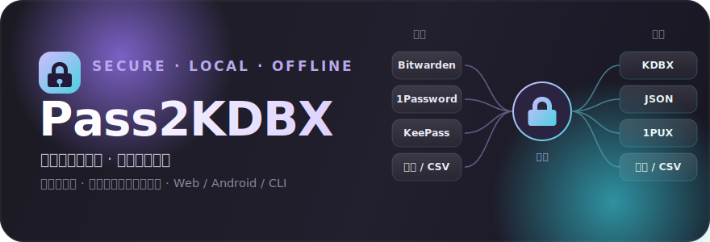
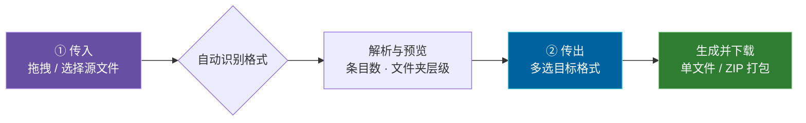
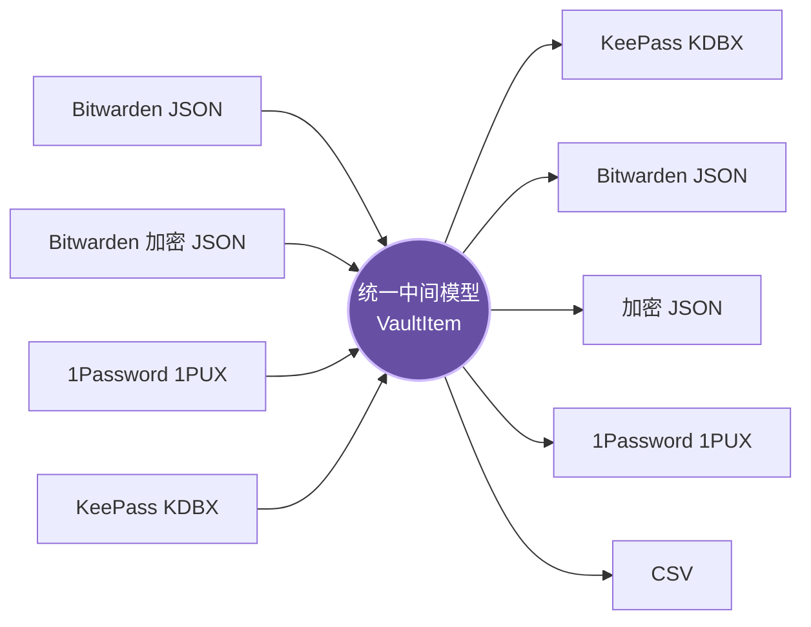
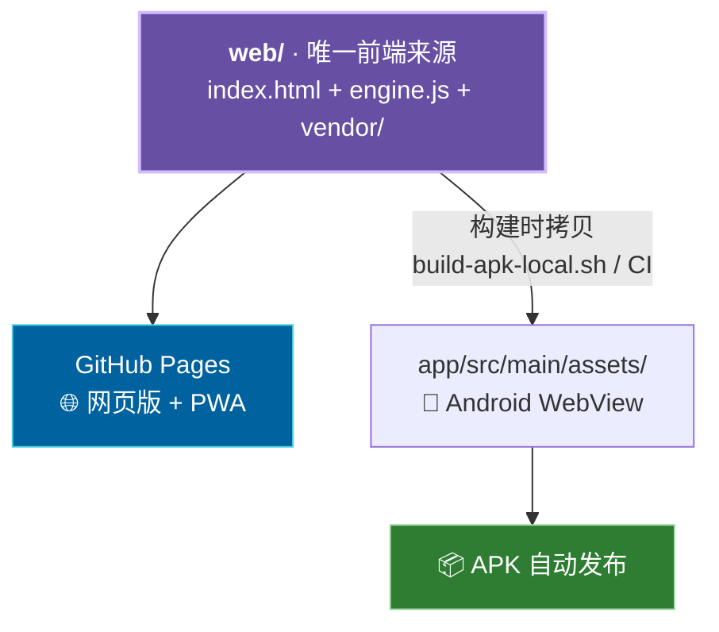

<p align="center">
  
</p>

<h1 align="center">Pass2KDBX 🔐</h1>

<p align="center">
  <b>密码管理器格式「万能互转」工具</b><br>
  传入任意导出文件 · 传出任意目标格式 · 纯本地处理，数据不经过任何服务器
</p>

<p align="center">
  <a href="LICENSE"></a>
  
  
  
  
  
</p>

<p align="center">
  <a href="https://key.valk.ccwu.cc"><b>🌐 打开网页版</b></a> &nbsp;·&nbsp;
  <a href="https://github.com/Chaniug/bw2keepass/releases/latest"><b>📱 下载 Android APK</b></a> &nbsp;·&nbsp;
  <a href="#-命令行工具python"><b>💻 命令行</b></a>
</p>

---

## 💡 这是什么

**Pass2KDBX** 是一个在 Bitwarden、1Password、KeePass 等主流密码管理器之间自由搬运数据的转换工具。它把每一种导出格式都解析为**统一的中间模型**，再渲染到你选择的任意目标格式——因此支持**任意源 → 任意目标**的组合，而不仅是「A 转 B」。

整个转换过程 **100% 在本地完成**（浏览器 / App / 命令行），你的密码库**从不上传任何服务器**。

> 🎯 **心智模型：传入（Import）→ 传出（Export）**
> 先把手里的任意导出文件「传入」，工具自动识别格式并预览；再勾选想要的「传出」格式（可多选、可打包下载）。换管理器不再纠结格式，一次搞定。

---

## 🖼️ 两阶段向导（传入 → 传出）

网页端与 App 端共用一套 Material Design 3「液态玻璃」界面，转换被拆成清晰的两步：



| 阶段 | 你要做的 | 工具自动完成的 |
|------|----------|----------------|
| **① 传入** | 拖拽或选择导出文件（`.json` / `.csv` / `.zip` / `.1pux` / `.kdbx`） | 自动识别源格式；KDBX 提示输入主密码、加密文件弹窗解密；解析后预览条目 / 文件夹数 |
| **② 传出** | 勾选一个或多个目标格式，按需填写密码 | 生成全部产物；多个文件一键打包 ZIP 下载 |

---

## 🔄 转换矩阵（任意源 → 任意目标）

所有格式都会先解析成统一中间模型 `VaultItem`，再渲染到目标格式，因此**每一个源都能转到每一个目标**：



<div align="center">

|  源 ＼ 目标  | KDBX | Bitwarden JSON | 加密 JSON | 1PUX | CSV |
|:--|:--:|:--:|:--:|:--:|:--:|
| **Bitwarden JSON**    | ✅ | ✅ | ✅ | ✅ | ✅ |
| **Bitwarden 加密 JSON** | ✅ | ✅ | ✅ | ✅ | ✅ |
| **1Password 1PUX**    | ✅ | ✅ | ✅ | ✅ | ✅ |
| **KeePass KDBX**      | ✅ | ✅ | ✅ | ✅ | ✅ |

</div>

> 依赖全部**本地化 / 离线可用**：`kdbxweb`（KDBX 读写）、`hash-wasm`（Argon2）、`JSZip`（打包），网页端不再依赖任何 CDN。

---

## ✨ 功能特性

- 🔄 **任意源 ↔ 任意目标**：4 种源 × 5 种目标全组合互转，一次转换可产出多个格式
- 🔑 **Passkey 完整迁移**：FIDO2 / WebAuthn 凭据在 Bitwarden 与 KeePassXC 间无损迁移
- 🔐 **密码保护导出**：可输出 Bitwarden 兼容的加密 JSON（AES-CBC-256 + HMAC-SHA256），能被 Bitwarden 或本工具重新解密导入
- 🧩 **1Password 支持**：导入 / 导出官方 `.1pux`，与 Bitwarden 能力对等
- 📊 **CSV 导出**：通用 / Bitwarden / KeePass 三种 CSV 格式
- 📁 **保留结构**：文件夹层级、自定义字段、密码历史、TOTP、URI 完整保留
- 🛡️ **隐私优先**：网页 / App / CLI 均本地运行，**零上传、无后端、无追踪**
- 📱 **跨平台**：网页版 + Android APK + iOS PWA，一套代码三端一致

### 支持的密码项类型

| 类型 | 说明 | 迁移 |
|------|------|:---:|
| 🔓 登录 | 用户名 / 密码 / TOTP / 多 URI | ✅ |
| 📝 安全笔记 | 富文本备注 | ✅ |
| 💳 卡片 | 信用卡 / 银行卡 | ✅ |
| 🪪 身份 | 姓名 / 地址 / 证件等个人信息 | ✅ |
| 🔐 SSH 密钥 | 私钥 / 公钥 / 指纹 | ✅ |
| 🗝️ Passkey | FIDO2 / WebAuthn 凭据 | ✅ |

---

## 📥 下载与安装

### 方式一：安装原生 App（推荐）

| 平台 | 获取方式 | 说明 |
|------|----------|------|
| 🤖 **Android** | [下载最新 APK](https://github.com/Chaniug/bw2keepass/releases/latest) | 直接安装，无需 Google Play |
| 🍎 **iOS** | Safari 打开网页版 → 分享 → 添加到主屏幕 | 作为 PWA 全屏离线使用 |
| 💻 **桌面端** | 直接打开[网页版](https://key.valk.ccwu.cc) | 无需安装 |

<details>
<summary><b>📱 Android 安装步骤</b></summary>

1. 点击上方链接下载 `Pass2KDBX.apk`
2. 系统设置 → 安全 → 允许「未知来源」安装
3. 点击下载的 APK 完成安装

</details>

<details>
<summary><b>🍎 iOS 安装步骤（PWA）</b></summary>

1. 用 Safari 打开 [key.valk.ccwu.cc](https://key.valk.ccwu.cc)
2. 点击底部「分享」按钮 →「添加到主屏幕」
3. 主屏出现独立图标，可全屏运行并离线使用

</details>

### 方式二：直接使用网页版

👉 **[打开网页版转换器 · key.valk.ccwu.cc](https://key.valk.ccwu.cc)**

无需安装，支持所有现代浏览器。手机 Chrome / Edge 也可「添加到主屏幕」作为 PWA 使用。

---

## 📦 命令行工具（Python）

### 安装

```bash
git clone https://github.com/Chaniug/bw2keepass.git
cd bw2keepass
pip install -r requirements.txt
```

### 通用模式（`--from` / `--to`，推荐）

一条命令即可完成「任意源 → 任意目标（可多选）」：

```bash
# 自动探测源格式，转为 KDBX
python -m bw_to_keepass in.1pux out --to kdbx

# Bitwarden JSON → 同时产出 KDBX + JSON + 1PUX
python -m bw_to_keepass in.json out --from bitwarden --to kdbx,json,1pux

# KDBX → JSON + CSV（多目标时 out 作为基名，自动追加扩展名）
python -m bw_to_keepass vault.kdbx out --from kdbx --to json,csv --password "master_pwd"
```

> 多目标时 `output` 作为基名，自动追加对应扩展名：`out.kdbx` / `out.json` / `out.1pux` / `out.csv`。

### 快捷别名（兼容旧用法）

```bash
# 正向：Bitwarden / 1Password → KDBX（自动识别源）
python -m bw_to_keepass bitwarden_export.json output.kdbx --password "your_password"

# 反向：KDBX → Bitwarden JSON（= --from kdbx --to bitwarden）
python -m bw_to_keepass --reverse input.kdbx output.json --password "your_password"

# CSV 导出：KDBX → CSV（= --from kdbx --to csv）
python -m bw_to_keepass --csv input.kdbx output.csv --password "your_password"

# KDBX → Bitwarden 密码保护加密 JSON（见下节）
python -m bw_to_keepass --reverse input.kdbx output.json \
    --password "your_password" --export-password "export_pwd"
```

### 命令行参数

| 参数 | 说明 |
|------|------|
| `input` | 输入文件路径 |
| `output` | 输出文件路径（多目标时作为基名） |
| `--from`, `-f` | 源格式：`auto`（默认，自动探测）/ `bitwarden` / `encrypted` / `1password` / `kdbx` |
| `--to`, `-t` | 目标格式，逗号分隔可多选：`kdbx,json,bitwarden,encrypted,1pux,csv` |
| `--password`, `-p` | 源读取密码（KDBX 主密码 或 Bitwarden 导出密码）；缺省则交互式输入 |
| `--db-password` | 写出 KDBX 目标时的数据库主密码；缺省则对新建库交互式设置 |
| `--name`, `-n` | 数据库名称（默认 `Pass2KDBX Import`，仅写出 KDBX 时生效） |
| `--reverse`, `-r` | 别名：`--from kdbx --to bitwarden` |
| `--csv`, `-c` | 别名：`--from kdbx --to csv` |
| `--csv-format` | CSV 格式：`generic`（默认）/ `bitwarden` / `keepass` |
| `--export-password`, `-e` | 写出加密 JSON，或解密 Bitwarden 加密导出时的密码 |
| `--salt-mode` | 加密导出 salt 处理方式：`utf8`（默认）/ `base64` |
| `--key-file`, `-k` | KeePass 密钥文件（可选） |
| `--email` | 账户限制型加密导出解密用：Bitwarden 账户邮箱 |

---

## 🔐 加密导出（密码保护）

将 KDBX 反向转换为 Bitwarden JSON 时，可勾选「加密导出」并设定导出密码，输出**密码保护加密 JSON**。该格式与 Bitwarden 官方加密导出完全兼容，采用 **AES-CBC-256 + HMAC-SHA256（encType 2）**，密钥由 PBKDF2 / Argon2 派生后经 HKDF 拉伸得到。

```bash
python -m bw_to_keepass --reverse input.kdbx output.json \
    --password "your_password" --export-password "export_pwd"
```

> 网页版：在「传出」阶段勾选「加密 JSON」，填写导出密码即可。

### salt 模式说明

Bitwarden 加密导出对 `salt` 字段的处理在不同版本 / 客户端间存在分歧：

| 模式 | 含义 | 适用场景 |
|------|------|----------|
| `utf8`（默认） | 使用 salt 字符串的 UTF-8 字节参与 KDF | 对齐常见 Bitwarden 导出 |
| `base64` | 使用 salt 的 base64 解码字节（官方文档标准） | 可移植性更好，跨客户端通用 |

> 💡 若导入 Bitwarden 时提示密码错误或无法识别，换用另一种 `--salt-mode` 重试即可；密文算法本身两种模式一致。

<details>
<summary><b>📥 导入 Bitwarden 步骤</b></summary>

1. 用本工具生成加密 JSON（设好导出密码）
2. 打开 Bitwarden → **工具 → 导入数据**
3. 选择格式 **Bitwarden（密码保护）JSON**，上传文件并输入导出密码
4. 导入完成后即可在原 vault 中查看全部条目

</details>

---

## 🏗️ 架构：单一前端来源

网页版与 Android App **共用同一套前端**（`web/`），App 在构建时把 `web/` 拷入自己的 assets，避免两套 UI 各自维护、行为不一致：



- **改 UI 只需改 `web/`**，构建脚本自动同步到 App，两端始终一致。
- **转换引擎 `web/engine.js`** 为纯逻辑（无 DOM），暴露 `run(opts)`（完整转换）与 `parseSource(opts)`（仅解析预览）。
- **离线依赖** 全部内置于 `web/vendor/`，不依赖 CDN。

---

## 🛠 项目结构

```
bw2keepass/
├── bw_to_keepass/            # Python 命令行工具 + 转换核心
│   ├── __main__.py           # CLI 入口（--from / --to 通用模式）
│   ├── convert.py            # 任意源→任意目标 转换中枢
│   ├── parser.py             # 解析为统一中间模型 VaultItem / Folder
│   ├── encrypted.py          # Bitwarden 加密导出 加/解密
│   ├── onepassword.py        # 1Password 1PUX 解析
│   ├── reverse_to_1password.py # 导出为 1Password 1PUX
│   ├── csv_exporter.py       # CSV 导出（generic / bitwarden / keepass）
│   ├── converter.py          # 正向转换（BW → KDBX）
│   ├── reverse_converter.py  # 反向转换（KDBX → BW）
│   └── writer.py             # KeePass 数据库写入器
├── web/                      # ✨ 唯一前端来源（网页版 + PWA）
│   ├── index.html            # 传入 → 传出 两阶段向导（MD3 液态玻璃）
│   ├── engine.js             # 转换引擎（纯逻辑，run / parseSource）
│   ├── vendor/               # kdbxweb / argon2 / jszip 离线依赖
│   ├── manifest.json         # PWA 清单
│   └── sw.js                 # Service Worker（离线支持）
├── app/                      # Android App 工程（构建时复用 web/）
│   ├── README.md             # App 工程说明
│   ├── build-apk-local.sh    # 本地构建脚本（含 web/→assets 同步）
│   └── src/main/
│       ├── java/cc/valk/pass2kdbx/MainActivity.java  # WebView 壳 + 保存/取色桥接
│       └── assets/           # 构建时由 web/ 同步生成（勿手改）
├── tests/                    # 测试（含 test_matrix.py 全组合矩阵）
├── docs/                     # README 资源（banner.svg 等）
├── .github/workflows/        # CI：build-apk.yml / deploy-pages.yml
├── requirements.txt
└── README.md
```

---

## 🧪 开发与测试

```bash
pip install -r requirements.txt
python -m pytest -q
```

当前测试覆盖：**76 passed + 30 subtests**，其中 `tests/test_matrix.py` 对 **4 源 × 6 目标全组合** 与 **格式两两往返** 做保真校验（往返后条目数一致、目标产物可正常打开）。

---

## 🔒 隐私说明

- **网页版**：所有数据在浏览器本地处理，不发送到任何服务器
- **Android APK**：WebView 运行本地前端（依赖本地化，离线可用），无后端、无数据收集
- **CLI 工具**：本地运行，无网络请求

> 🛡️ 你的密码库始终只在你自己的设备上。开源可审计，欢迎自行验证。

---

## 📄 License

本项目基于 [MIT License](LICENSE) 开源。

<p align="center">
  <sub>Made with 🔐 for people who take their passwords into their own hands.</sub>
</p>
